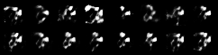
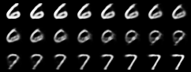
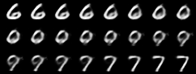
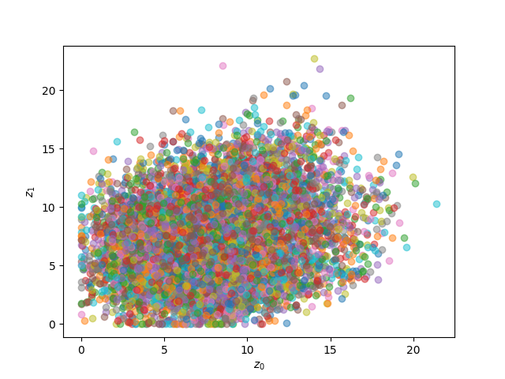

### Some personal notes
This repository contains pytorch implementation of the Variational Autoencoder (VAE) and the vanilla Autoencoder. 
This reflects my journey learning the VAE and its applications for a variety problems in science. 
Playing around with the VAE is a good way to enter the "generative AI" world as the 
vanilla VAE is simple yet very effective for synthesized data generation tasks.

### Quick overview

We will implement two models that are an autoencoder (AE) and a variational autoencoder (VAE).
The VAE is a variant of AE. The VAE is suitable for data inference problem (e.g., 
you try to estimate the underlying probability distribution of the dataset). Note that the main target of 
the data inference problem is different from a pattern classification problem (where you train models with 
labels and classify the input data samples into different classes). In other words,
we will not use any labels of the MNIST dataset in the following examples. Instead, we will use
unsupervised training to do data inference. The output of the VAE will tell us the
probability distribution of the input data samples. After modelling the prob. distribution,
we will generate some new data samples from the models (i.e., no data samples from the train/test
MNIST are required here). We then compare the VAE and the AE in the data generation task.
The final exercise (most fun) will be data interpolation using the learned latent space of the VAE.

### Install packages
You will need to install `matplotlib`, `numpy`, `torch`, and `torchvision`, by running command:

`pip install -r requirements.txt`

### Model architecture
Figure below shows the model architectures of the AE and VAE. We observe that
the VAE only modifies one hidden layer of the AE. This is for the reparameterization 
trick (see [original paper](https://arxiv.org/abs/1312.6114)). The main idea is that we 
turn the latent space of the AE into something more useful for downstream tasks, e.g., 
synthetic data generation, data interpolation, etc. Note that the vanilla VAE has
some issues with the data reconstruction task (e.g., blurry outputs) due to the VAE
is trained by optimizing the variational lower bounds (i.e., ELBO). It will be useful
to use VAE for data generation, data interpolation, data compression, etc. If you're looking 
for VAE models for data reconstruction (e.g., inverse problems), you may need to use 
other variants of the VAE (e.g., [normalizing flows](https://arxiv.org/abs/1505.05770)).

Architecture of the VAE:

Architecture of the AE:

### Training models
Run `python main.py` to train the VAE and AE on MNIST dataset. You will see the only  
difference between two models is the `reparameterize` function of the `VAE` class.
Let's train the VAE and AE for `30` epochs. After training, we use pre-trained models to 
do the following tasks: (i) data generation and (ii) data interpolation.
### Evaluation
#### Evaluation 1 - Data generation
Let's generate random samples from the generators of the VAE and AE. For this
we create a random vector `z = torch.randn(num_samples, model.latent_dim)` then
pass this vector through the models' decoders by simply using `model.decode(z)`.
We compare the samples generated from the two figures below. Top and bottom figures 
contain `16` images generated by the VAE and AE, respectively.
We can see that some images in Fig. 1(a) look like handwritten digits (e.g., 3, 9, 7)
and some look not so good. In Fig. 1(b), it's hard to tell these images are readable.

Fig. 1(a). Images generated from the VAE

Fig. 1(b). Images generated from the AE

#### Evaluation 2 - Data interpolation
In this task, we will try to do a simple interpolation as follows. Given two data points
from the test set (i.e., image `6` (top left) and image `7` (bottom right) in Fig. 2 below).
We will make a transition from image `6` to `7`. These functions in the `main.py` file are 
`vae_interpolation` and `autoencoder_interpolation`. The main idea is that
given two data points `x_1` and `x_2`, we generate intermediate data points `x_j`
to create a transition from data point `x_1` to `x_2`. In other words, only two data points
at the top left and bottom right of Fig. 2(a) are real data points (taken from the MNIST test set).
The other images in Fig. 2(a) are generated by the VAE. Same procedure applies for Fig. 2(b).
In this example, we see that the data interpolation abilities of two models are also similar.
The only difference is in the middle rows of Fig. 2(a) and Fig. 2(b). The middle row
of Fig. 2(a) looks a bit smoother in transition, while half images in the middle row of
Fig. 2(b) look identical.

Fig. 2(a). Data interpolation with VAE

Fig.2(b). Data interpolation with AE

#### Let's look into the latent spaces of the two models
The smoother transition of the VAE can be explained by its symmetric latent space, i.e., multivariate 
Gaussian, as shown in Fig. 3 below. The latent spaces of VAE and AE have the same size of 20 dimensions.
In Fig. 3, we visualize two dimensions `z_0` and `z_1` of the learned latent spaces.
Fig. 3(a) shows that the learned latent space looks similar to 2-dimension Gaussian distribution, i.e.,
data points are centered around 0 and bounded between -3.0 and 3.0. With the latent space 
of AE in Fig. 3(b) we don't see a clear distribution for it. Thus, the data interpolation
using the latent space, as well as the data generation from this latent space, of the AE is limited.

Fig. 3(a). Latent space of VAE

Fig. 3(b). Latent space of AE

